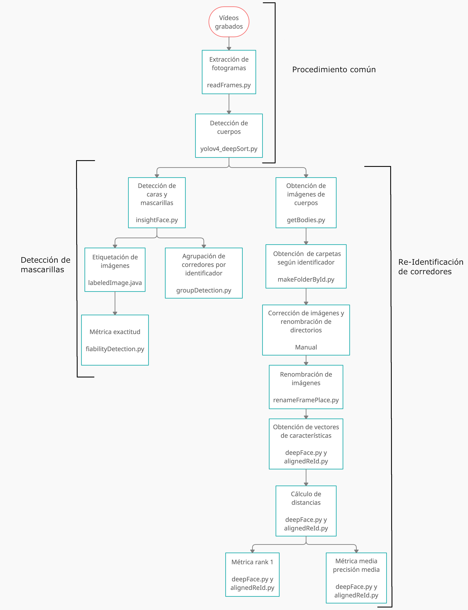

# Re-identificacion basada en caras en tiempos de pandemia

La pandemia a cambiado por completo la forma en que nos comportamos. Un caso evidente, son las carreras populares, el riesgo de infectarse del SRAS-CoV-2 ha provocado el uso obligatorio de mascarillas en muchas carreras populares. Por eso, en este trabajo comprobamos como distintas técnicas de detección y re-identificación se comportan en una carrera popular. En este Trabajo de Fin de Grado, poseemos imágenes de distintos corredores para analizar, por lo que se disponen de imágenes de las mismas personas con y sin mascarilla para evaluar cómo se ven afectados los métodos de detección y re-identificación.

A continuación mostramos un diagrama de flujo que describe los pasos a seguir para ejecutar la solución software.

	

